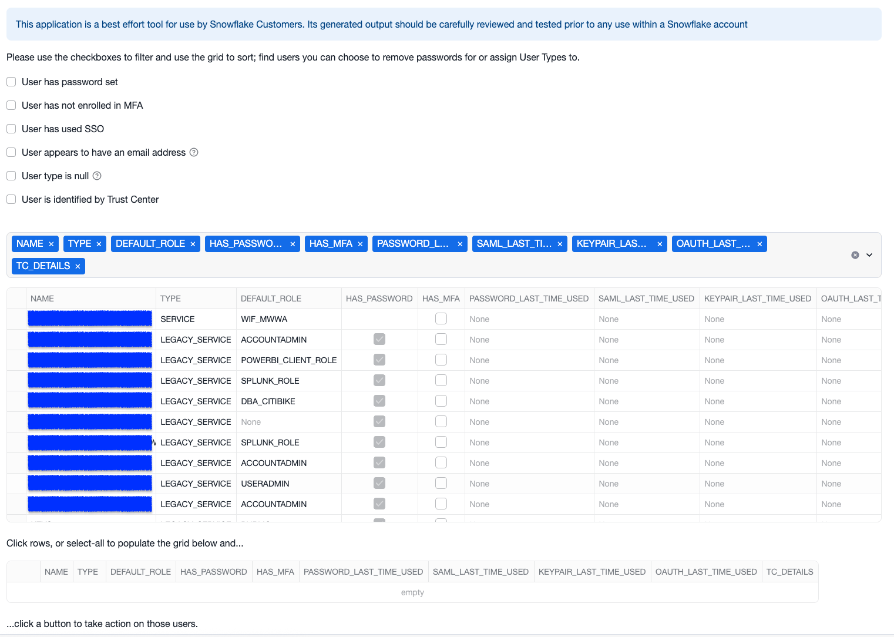

# SAFE: Strong Authentication Flow Evaluator


-----

## Overview

The **Strong Authentication Flow Evaluator (SAFE)** is a Streamlit-based application designed to assist Snowflake Account Administrators in evaluating the authentication methods used within their Snowflake accounts. Developed and maintained by the Snowflake Security Applied Field Engineering (SAFE) team, this application helps administrators ensure their current account configurations comply with upcoming Snowflake policy changes. These changes deprecate single-factor password sign-ins and limit allowed authentication methods based on user **TYPE**.

SAFE aggregates findings from `LOGIN_HISTORY`, configured authentication options, and other account metadata. This allows administrators to make informed decisions regarding a user's object **TYPE** and its required authentication methods. The **ACTIONS** section within the application empowers administrators to **SET** the appropriate **USER TYPE** and **UNSET PASSWORDS** where necessary, accelerating the creation of authentication policies and promoting adherence to best practices for user object management in Snowflake.

The tool acts as an interactive wrapper for the guidance outlined in:

  * [Snowflake Perimeter Security Guidance](https://docs.snowflake.com/en/user-guide/admin-security-perimeter)
  * [Password Eradication (SAFE app)](https://medium.com/snowflake/password-eradication-2094d4fc5a56)
  * [Snowflake SAFE Medium List](https://medium.com/snowflake/tagged/safe)




-----

## Features

The SAFE App UI enables discovery and seamless remediation by providing the following features:

  * **Identifies static credentials** in Snowflake for eradication (unset) or enrollment in MFA (Passkeys, TOTP, Duo).
  * **Discovers client authentication patterns** to help set the appropriate user type.
  * **Highlights non-human identities** (machine-to-machine flows) that need to adopt OAuth, Workload Identity Federation, Key Pair, or Programmatic Access tokens for the **SERVICE** user type.
  * **Provides a clear dashboard** of authentication factors across your Snowflake environment.
  * **Lightweight and quick to deploy** using Streamlit.
  * Low compute requirements: the application can run as a Streamlit in
    Snowflake on an XS warehouse. The application does not store any state.

-----

## Use Cases

As Snowflake continues to enforce modern authentication requirements, SAFE helps shorten the time to value by:

  * Running checks against `login_history` and `users` views.
  * Setting the appropriate user type (**HUMAN**, **SERVICE**, **LEGACY\_SERVICE**).
  * Flagging non-compliant authentication flows.
  * Facilitating discovery to plan remediation or automation updates to authentication patterns.
  * Eradicating static credentials where applicable.

-----

## Roadmap

  * **CIDR discovery** for Account and User Level Network Policy discovery, enforcement, and least privilege measurement.

-----

## Contributions & Support

For contributions or support, please contact: [safe@snowflake.com](mailto:safe@snowflake.com).

-----

## Authors & Acknowledgements

A special thank you to the maintainers:

  * Vladimir Timofeenko
  * Peter Horrigan

And the Snowflake Security Applied Field Engineering Team - Americas:

  * Ryan O’Connell
  * Mike Mitrowski
  * Eugene Choi
  * Nick Nieves
  * Amir Durrani
  * Sean Cooper
  * Jake Berkowsky
  * Matt Barreiro

-----

## Requirements

The application can be run as a Streamlit in Snowflake or locally.

To run the application locally you will need:

- **Python 3.8+**
- **Snowflake account** with `ACCOUNTADMIN` or sufficient privileges to query `login_history` and `users`.
- [**Snowflake Python Connector**](https://docs.snowflake.com/en/developer-guide/python-connector)
- [**Streamlit**](https://streamlit.io/)
- `toolz`
- A Streamlit connection set up through [Streamlit secrets][streamlit-secret-setup].


-----

## Installation

### Streamlit in Snowflake application (git integration)

To run the application and keep it up to date, you may use Snowflake git
integration:

```sql

USE ROLE ACCOUNTADMIN;
CREATE OR REPLACE API INTEGRATION gh_snowflake_labs
    API_PROVIDER = GIT_HTTPS_API
    API_ALLOWED_PREFIXES = ('https://github.com/Snowflake-Labs')
    ENABLED = TRUE;

USE ROLE sysadmin;
CREATE OR REPLACE DATABASE safe_app;
CREATE OR REPLACE GIT REPOSITORY safe_app.public.safe_app_repo
    API_INTEGRATION = GH_SNOWFLAKE_LABS
    ORIGIN = 'https://github.com/Snowflake-Labs/safe-app/';

USE ROLE accountadmin;  -- or a privileged role
CREATE OR REPLACE STREAMLIT safe_app.public.safe_app
    ROOT_LOCATION = '@safe_app.public.safe_app_repo/branches/main'  -- Optional: pin to a specific tagged version by specifying `/tags/vX.Y.Z`
    MAIN_FILE = '/streamlit_app.py'
    QUERY_WAREHOUSE = ; -- Replace the warehouse

-- Optional: GRANT USAGE ON STREAMLIT safe_app.public.safe_app TO ROLE custom_role
-- Optional: CREATE TASK that will keep the code up to date by running ALTER GIT REPOSITORY FETCH: https://docs.snowflake.com/en/developer-guide/git/git-operations#fetch-from-the-remote-git-repository
```

### Streamlit in Snowflake application (copy paste)

The application code is contained in [a single file][./streamlit_app.py].
1. Using `ACCOUNTADMIN` or another account with privileges to operate on users,
   create a blank Streamlit application
2. Add `toolz` to the list of dependencies
3. Copy and paste the code from the [`./streamlit_app.py` file](./streamlit_app.py)


### Local Streamlit application

This project is designed to run as a **Streamlit Native App** inside your Snowflake account.
1. Using your preferred python package management tool, install the dependencies
   from `pyproject.toml`
2. Set up [Streamlit secrets][streamlit-secret-setup] so the application can
   access Snowflake as a role with privileges to read from
   `SNOWFLAKE.ACCOUNT_USAGE` views (e.g., `login_history`, `users`) and the
   ability to operate on users.
3. Run the application: `streamlit run streamlit_app.py`

**Important Disclaimer:**

Customers should leverage internal policies and standards in addition to Snowflake guidance, including Snowflake’s Trust Center or the Cloud Security Posture Management (CSPM) tool of their choice, to guide any remediation effort. This resource is not a substitute for a thorough, services-led engagement, nor does it supersede any other obligations you may have to Snowflake, your organization, your outside regulators, or other bodies to which you owe compliance or conformance.

-----

## License

This project is licensed under the Apache-2.0 license.

-----

[streamlit-secret-setup]: https://docs.streamlit.io/develop/concepts/connections/secrets-management
